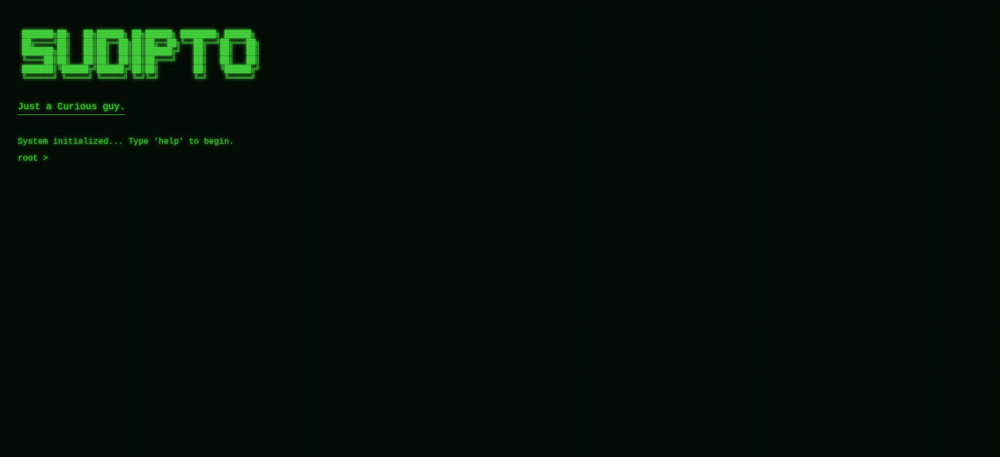
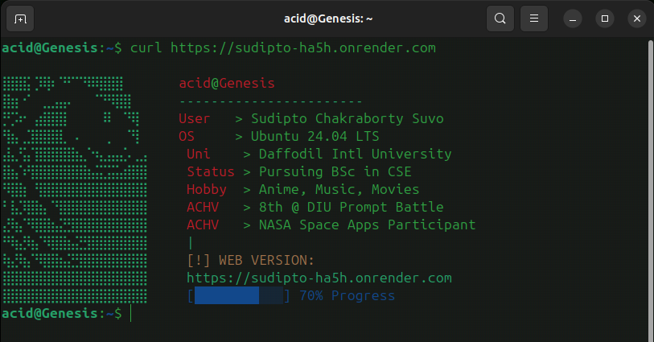

# 📟 Genesis Terminal CV
> **Sudipto Chakraborty Suvo (Acid)** | Just a curious guy

A retro-inspired, CRT-style portfolio designed for the modern web but built for the Linux terminal. This project features environment-aware rendering to serve a custom experience based on how you access it.

---

## 🌟 The Experience

### 🌐 Web Mode (Interactive CRT)
Experience a 1990s-style computer terminal directly in your browser.
* **Aesthetics:** Green glow, scanline overlays, and screen flicker animations.
* **Interactive:** A fully functional command-line interface (CLI).
* **Immersive:** Authentic mechanical boot-up sounds and typewriter text effects.

**[Preview of Web Interface]**


### ⌨️ Terminal Mode (CURL)
Built for the power user. No browser? No problem.
* **Neofetch Style:** Get a system-fetch summary directly in your shell.
* **Custom ASCII:** A high-density portrait sidebar.
* **Lightweight:** Pure text-based delivery for high-speed access.

**[Preview of Terminal Output]**


### 🎬 Interaction Demo
*Typewriter effect and command execution.*


---

## 🚀 Quick Start

### Web Access
Click here to launch: [sudipto-ha5h.onrender.com](https://sudipto-ha5h.onrender.com)

### Terminal Access (CURL)
Fire up your Ubuntu/Arch terminal and run:
```bash
curl [https://sudipto-ha5h.onrender.com](https://sudipto-ha5h.onrender.com)
